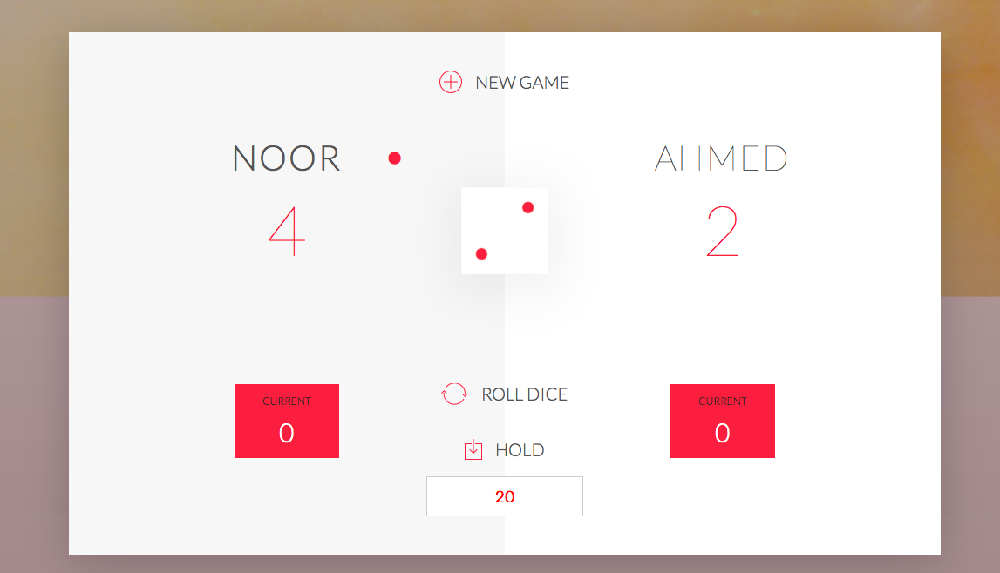

# GUESS-GAME-JAVASCRIPT-
this game was my first game and it is completely DOM BASED RULES ARE EXTREME
IF ONE PLAYER ROLE A DICE AND IT GET 6 BACK TO BACK THEN HE WILL LOOSE THE TOTAL SCORE AND IF USER ROLE THE DICE AND GET 1 THEN HE LOSE HIS DICE SCORE. SO BASICALLY BEFORE GAME BEGINS, PLAYER DECIDE ON HOW MANY TOTAL SCORE TO REACH BEFORE A PLAYER WINS SO IF PLAYER DEICDE WHO EVER REACH TO 100 FIRST FIRST WIN ,NOW IF U GET 6 FOLLOWED BY 6 WHEN U 99 HAHAHA UR DONE..JUST KIDDING U CAN CHOOSE TO PASS INCASE IF U DONT WANT TO RISK.

